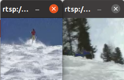

# live555_multithread_play
Play multiple h264 videos streamed from live555 via opencv multi-thread
## Supported cpu
- Amd x64 cpu, since `live.2025.05.24` was built on this cpu. If you have different cpu, please rebuild `live.2025.05.24`
## How to use
- step1: unzip `opencv-4.x.zip` and build opencv using the following command:

```
cd opencv-4.x
mkdir build && cd build
cmake -D CMAKE_BUILD_TYPE=RELEASE       -D CMAKE_INSTALL_PREFIX=/usr/local       -D WITH_GSTREAMER=ON       -D WITH_FFMPEG=ON  ..
```
- step2: build the main project

```
cd ../../
mkdir build && cd build && cmake .. && make
```
- step3: open a video streaming via live555 using the following command:

```
cd ../live.2025.05.24/live/mediaServer/ && ./live555MediaServer
```
- step3: additionally open a new terminal and play multiple h264 videos streamed from live555 via opencv multi-thread

```
cd build && ./RTSPStreamViewer rtsp://xxxx:yyyy/ ../live.2025.05.24/live/mediaServer/
```
## multi-thread display
<table style="width: 100%; border-collapse: collapse;">
    <tr>
        <td colspan="3" align="center" style="background-color: transparent;">
            
        </td>
    </tr>
</table>